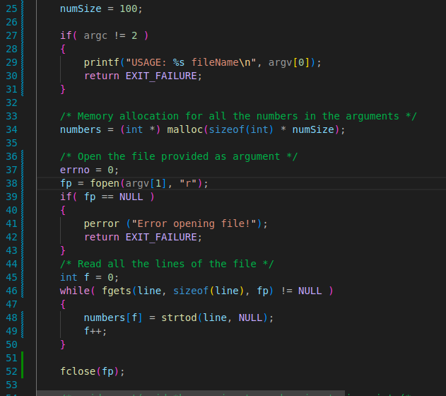
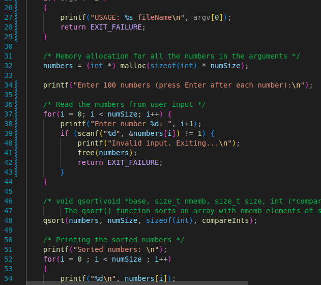
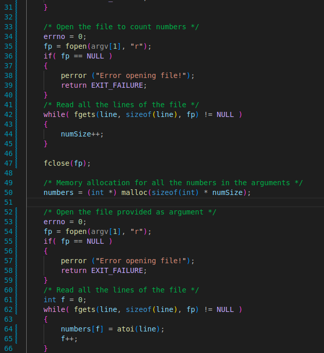

# Exercicio 1.
### a) 
- O programa começa por definir um máximo de linhas para ler de um ficheiro (80). Depois cria uma variável FILE* (fp), e começa por garantir que foi passado exatamente 1 argumento da linha de comandos.
Depois abre o ficheiro com a função `fopen(<filename>, "r")` (r de read), depois para cada linha do ficheiro, até (no máximo LINEMAXSIZE), vai imprimir linha a linha no terminal.
No final fecha a file com fclose().

### b) 
- A solução para este problema é, primeiramente, alterar o número máximo de argumentos que se pode passar, para isto, mudamos o != do primeiro if para <, depois vamos fazer um ciclo for a partir de i = 1 até argc, mandamos os comandos para abrir a file e o while para dentro do loop e, no fopes(argv[1],"r") mudamos o 1 para o i.

### c) 
- A solução para este problema é simples, basta inicializar uma variavel (int), imprimir esse valor no mesmo printf() em que imprimia a linha, e de seguida incrementar esse valor.

### d) 
- Este comportamento ocorre porcausa do limitador, LINEMAXSIZE = 80, quando este valor é excedido ele simplesmente passa para a próxima iteração do while. para resolver este problema, basta aumentar o valor de LINEMAXSIZE

# Exercicio 2.

### a) 
- O programa começa por determinar quantos números foram passados como argumento (numSize = argc -1),
de seguida, alocar memória para o array dos números a utilizar o malloc e guardar os valores nesse array. Depois usa a função qsort() para ordenar a lista usando a função compareInts.
No final imprime a lista ordenada, linha a linha.

### b)
- A solução é definir numSize = 100, e depois, em vez de ler os argumentos, lemos um ficheiro da mesma forma que o exercicio anterior fazemos um atoi para cada linha e adicionamos ao array.
- A usar fgets:

- A usar scanf:

### c)
- Para terminar este exercicio, utilizei o método de abrir o ficheiro 2 vezes, uma para contar quantas linhas estão e outra para adicionar os números ao array.

# Exercicio 3.
### a)
- O programa lê os inputs do utilizador formatando-os especialmente para serem reconhecidos pelo terminal, depois até que o texto introduzido seja "end" o programa vai estar sempre a correr, e depois utiliza a função system() para correr o comando inserido pelo utilizador no terminal.

### b)