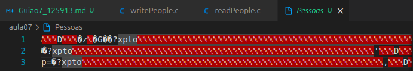
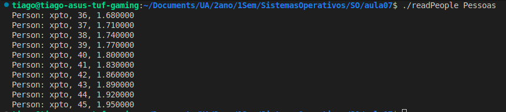
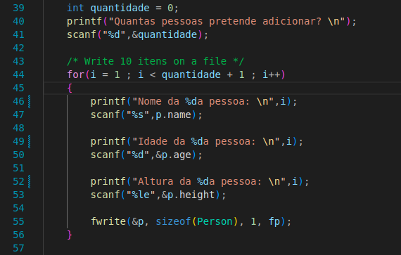
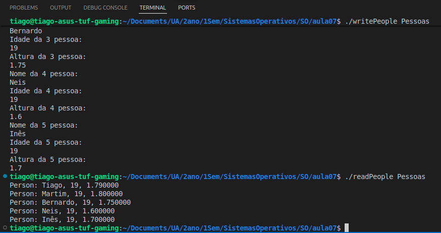
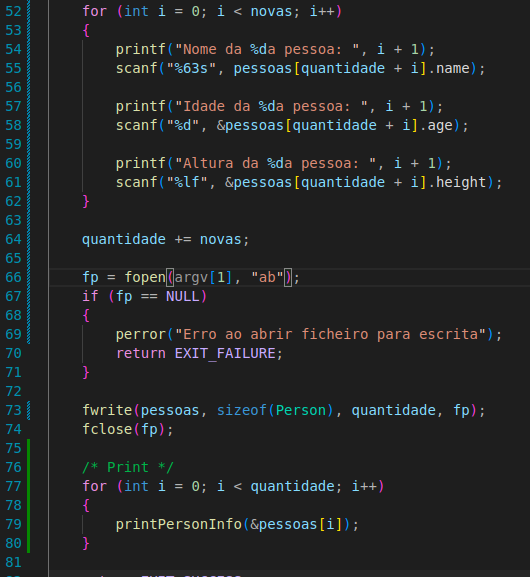
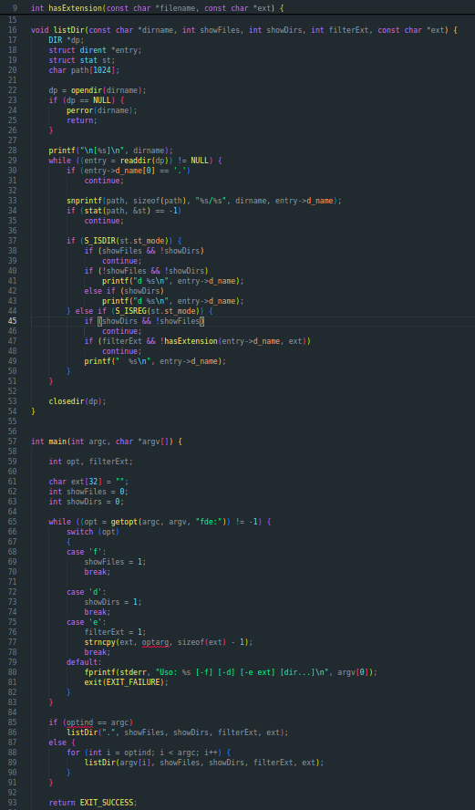
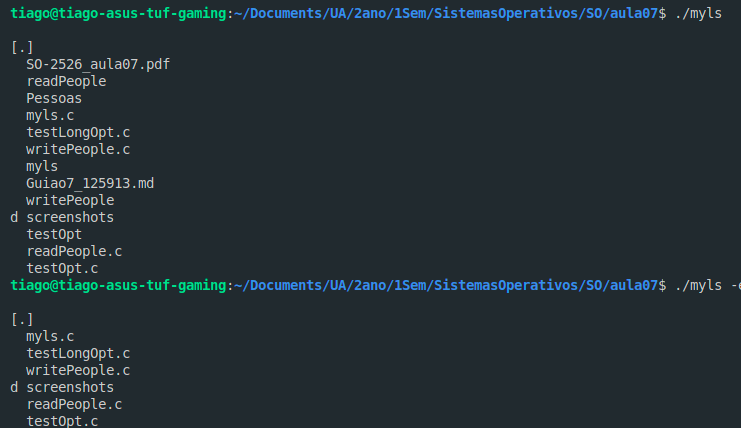
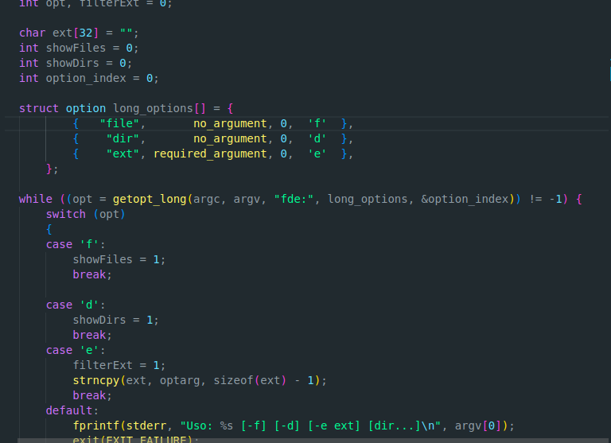

# Exercicio 1.
### a) 
- O programa writePeople começa por definir a estrutura o tipo Person (com idade height e name\[64\]). De seguida, no main, cria uma Person p = {35, 1.65, "xpto}, valida se existe exatamente 1 argumento passado no terminal, de seguida tenta abrir o ficheiro para escrita binária "wb" e de seguida escreve no ficheiro 10 pessoas com nomes iguais mas idades e alturas diferentes. 
A imagem de seguida mostra o que está dentro de um desses ficheiros binários que foi criado pelo programa:

O programa readPeople começa por defenir a estrutura de Person, define uma função do tipo void que dá print a uma pessoa. No main verifica que foi passado exatamente 1 argumento para o terminal. De seguida tenta abrir o ficheiro passado como argumento, e no fim a função fread(&p, sizeof(Person), 1, fp) verifica se ainda há persons para de seguida lhes dar print.

### b)
- 
 

### c)

- 

# Exercicio 2.
### a)

- O programa testOpt demonstra como a função getopt() processa argumentos da linha de comandos. Ela precorre arg\[v\] e devolve uma letra (n, t, ou ?) conforme os argumentos introduzidos. O terceiro parametro "nt:" indica: n -> opção sem argumento t: -> opção com argumento obrigatorio e o valor do argumento após -t é acessivel via optarg.
O indice do primeiro argumento nao opcional é guardado em optind.

### b)

- 

# Exercicio 3.

### a)

- O programa testLongOpt.c começa por definir uma estretura de opções (long_options) que contém os possiveis argumentos a serem inseridos no terminal. Cada "struct option" contém: name (ex.: add); has_arg (ex.:no_argument); flag (Usado para associar uma variável a essa opção); e o val (valor para a opção). Depois começa um ciclo While que enquanto o c (que é igual ao retorno de getopt_long que é o valor da opção identificada) for diferente de '-1' vai ficar a verificar o valor de c (Por exemplo se for qualquer uma das opções exceto a 'create' o programa vai definir c igual a 0 (porque é o valor de retorno) logo vai fazer o case 0, se for passado o 'create' vai fazer o case 'c' (porque o valor de 'create' é 'c')).

-