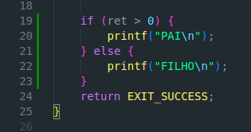
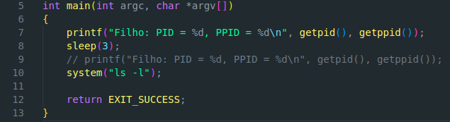
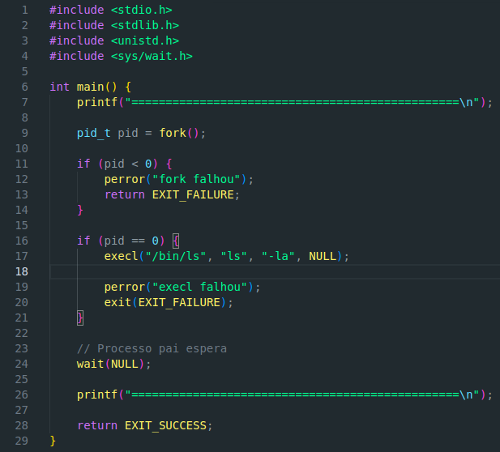

# Exercício 1
### a)

- fork é uma função que cria um novo processo. O espaço do endereço do novo processo (child process) é uma cópia do espaço endereço do calling process (processo pai); getpid é uma função que retorna o processo ID do processo que está a chamar; getppid é uma função que retorna o processo ID do calling process (processo pai)

### b)

- i) Vão ser impressas 5 linhas no terminal
- ii) O primeiro processo começa por imprimir o Antes do fork, depois, no if, acontece uma system call ao fork, o que vai criar um novo processo (nenhum processo chega a entrar no 'perror'). Depois da criação do novo processo, é impressa a linha Quem sou eu? e de seguida o Após o fork do segundo processo, o primeiro processo sucede o segundo a imprimir as mesmas linhas.
- iii)

### c)

- Correto

# Exercício 2

### a)

- A única diferença do fork2 para o fork1 é que no fork2, conseguimos ver qual é o valor de retorno do fork, neste caso, o segundo processo tem o valor do fork = 0, e o primeiro processo tem o valor fork igual a 12928. 

### b)

- Isto acontece porque o retorno de fork() (ret) é igual ao ID do processo do filho. Logo como o processo pai tem ret > 0, ele faz sleep(1) logo manda a mensagem por último

### Tarefa1.

-

# Exercício 3

### a)

- A system call Execl faz parte da familia de funções exec, é utilizado para substituir o processo atual por um novo programa, ou seja, quando um processo chama execl(), o seu próprio código é substituido pelo código do programa indicado, mantendo o mesmo PID. Ela pode ser chamada com um número ilimitado de parâmetros porque, cada um deles representa um argumento para o programa a ser chamado (int execl(const char *path, const char *arg0, ...,);)

### b)

- i) O primeiro parâmetro é utilizado para o sistema encontrar o arquivo executável para carregar. O segundo parâmetro é o argv[0] que é o nome pelo qual o programa vai identificar-se internamente
- ii) O comando shell equivalente à invocação é apenas ./child

### c)

- i) O printf() logo após a chamada ao sistema execl() não é lido porque o processo que estava a correr este bloco do switch (processo filho) deixou de ler o programa fork3 e passou para o programa child. O bloco default ainda é corrido porque o processo pai ainda está neste programa.

- ii) Os valores do PPID do child são diferentes antes e após o sleep, porque enquanto o child estava a fazer sleep(3), o programa do processo Pai acabou, logo o filho vai ficar com o PPID do processo adotante.

- iii) Esta anomalia acontece pois o programa em que estava a correr o processo Pai termina enquanto o programa onde está a correr o filho ainda está a correr, logo, o prompt surge após o término de fork3 e logo de seguida é impresso o útlimo print do child

### Tarefa 2.

-

# Exercício 4.

### a)

- O system call wait() suspende a execução da thread pai até um dos seus filhos terminar; O system call waitpid() suspende a execução da thread pai até uma child (especificada pelo argumento pid) mudar de estado. A diferença entre wait e waitpid é que wait é até o filho morrer e o waitpid é quando mudar de estado.

### b)

- i) Agora o fundamentalmente mudou, em relação a fork3, é que o processo Pai só vai terminar depois do processo filho morrer devido ao wait(&stat).

- ii) A ordem nova de impressão agora é: 1. print do pai antes do fork; 2. print do pai depois do fork; 3. print do filho antes do sleep; 4. print do filho depois do sleep; 5. print do pai a dizer q o filho terminou

### Tarefa 3.

-

# Exercício 5.

### a)

- O programa começa por imprimir o ID do processo, de seguida enquanto o i (que inicialmente é 0) não for igual a 10, vai ficar a imprimir o i e dar sleep(1). O fflush(stdout) serve para garantir que o printf() não fica em buffer e seja impresso imediatamente após a instrução.

### b)

- CTRL-C Força o término do processo

### c)

- CTRL-Z Dá stop ao processo sem o terminar, se executarmos o comando jobs aparece todos os processos que estão pausados, estes podem ser retomados com o comando fg ou com o comando bg (a diferença é que, ao contrario de fg, o bg força o Processo a correr até termianr).

# Exercício 6.

### a)

- sigaction é uma system call usada para mudar a ação tomada por um processo quando recebe um determinado sinal.

### b)

- Agora, mesmo com CTRL-C o processo não pode parar, porque normalmente esta combinação de teclas envia SIGINT que a sua ação é terminar o processo, logo, ao emvés do programa terminar como esperado, chama a função Interrupt e vai escrever "Calma, ainda não cheguei a 50".

### c)

- Confirmado.

### d)
- kill é uma system call que pode ser usada para mandar qualquer sinal a qualquer grupo ou processo.

### e)
- kill -SIGSTOP PID faz com que o processo sig2 fique automaticamente parado.

### f)

- Para retomar a sua execução basta fazer kill -SIGCONT PID.

### Tarefa 4. 

-