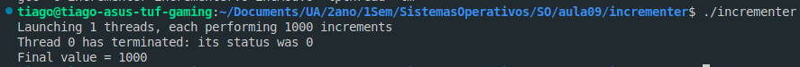
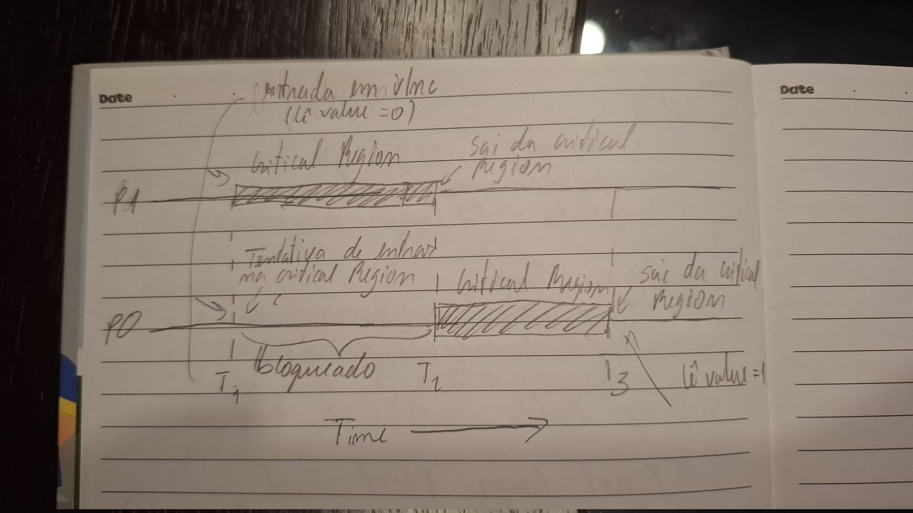
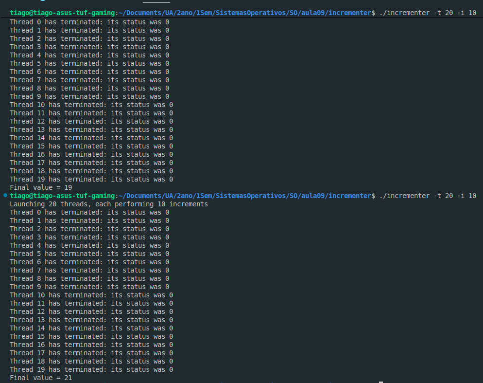
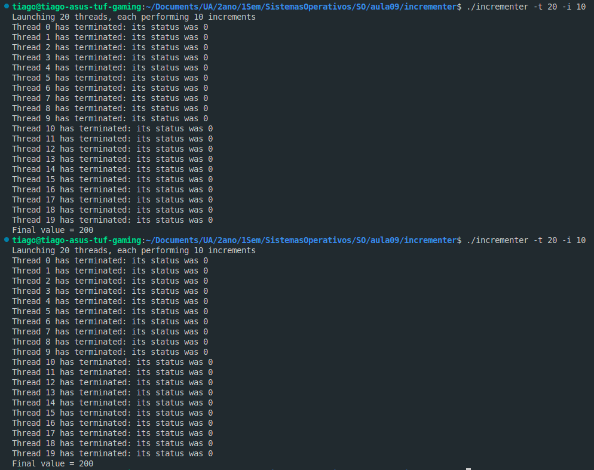
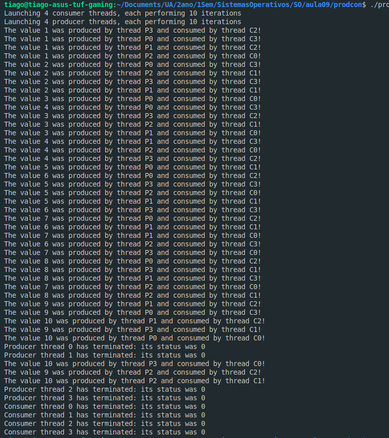

# Exercício 1
### a)
- incMod.c é um ficheiro que usa a diretiva math.h para criar um time delay, o vSet para dar set ao valor da variavel, vGet para retornar o valor da variavel e, principalmente o vInc para incrementar o valor da variavel usando a função delay com o valor BIG = 5000.

### b)
- O programa incrementer começa por defenir valores por omissão às variaveis niter (1000) e nthr (1), cada um representa o número de incrementos e o número de threads (respetivamente). De seguida o programa vai ler as flags -i, -t e h, para permitir alterar os valores das respetivas variaveis (h para show usage). Principalmente, o programa começa por dar set à variavel = 0, cria nthr threads, e lança-as a todas no ciclo for. Depois começa outro ciclo pra esperar as threads terminarem e no final dá print ao valor final do incremento. Por omissão como existe 1 thread e 1000 incrementos, o valor final do incremento deverá ser 1000.

### c)
- 

### d)

- i) A região partilhada consiste que, quando várias threads estão a ser executadas simultaneamente num único código.

- ii) A região crítica acontece na função vInc(), porque é a parte do código que todos os threads executam ao mesmo tempo.

- iii)
- 

- iv) Num monoprocessador, se lançarmos um número superior a 1 de threads para fazer o mesmo trabalho ao mesmo tempo, vai gerar uma região crítica (vInc()) e ambos vão ler o mesmo valor antigo de value, o que vai resultar em resultados inconsistentes, o que caracteriza a condição de corrida

- v) Se N threads fizessem 1000 incrementos, o resultado iria variar entre 1000 (minimo) e N * 1000 (máximo). O minimo deve-se ao facto que a região crítica não entra em descanço enquanto existirem processos, isto é, em todas as tentativas dos 1000 incrimentos, pelo menos 1 incremento por tempo ocorre. O máximo deve se ao facto de ser o máximo possivel de incrementos a realizar N threads * 1000 incrementos, embora este resultado seja extremamente improvavel de acontecer.

- vi) 
SMALL, SMALL, o tempo é mímimo, as trocas de processadores acontecem menos dentro da região crítica ao que leva a menos race conditions, o resultado tende a aproximar-se do esperado.
BIG, SMALL, o processador entra e lê Value e bloqueia com o valor antigo, outros processos entram e lêm valores diferentes, quando o processo inicial finalmente escreve, este valor pode ser muito diferente e ultrapassado (pior caso possivel) o resultado aproxima-se do mínimo.
SMALL, BIG, o thread faz a escrita rapidamente, mas fica muito tempo bloqueado o que atrasa outros processos. O Valor é quase o maior possivel.

### e)

- Primeiro delay BIG segundo delay SMALL
- 

- Primeiro delay SMALL segundo delay BIG
- 

- Ambos delays SMALL
- 

# Exercício 2

### a)

- pthread_mutex_lock(): A função pthread_mutex_timedlock(), fecha o objeto referenciado pelo mutex e a função pthread_mutex_lock(), se o mutex já estiver fechado, a calling thread fica bloqueada até o mutex ficar disponivel.

- pthread_mutex_t(): descreve um thread mutex.

- pthread_mutex_unlock(): Se o thread currente tiver com o mutex bloqueado, então esta função desbloqueia o mutex.

### b)

- O código incModSafe.c é parecido com o incMod.c, com a excessão de usar mutexes para controlar as threads. o vSet começa por trancar o mutex, o que garante que mais nenhum outro thread pode mexer no código ao mesmo tempo, atualiza a variavel, e por fim destranca o mutex, permitindo que outros threads entrem. A mesma estrutura é usada no método vGet e no vInc.

### c)

- Agora, com o uso de mutexes e o seu trancamento, o resultado vai deixar de variar independente da quantidade de vezes que executarmos o programa.

# Exercício 3

### a)

- pthread_cond_wait(): esta função permite trancar a thread chamadora em uma condição variavel cond, e destranca o mutex associado.

- pthread_cond_signal(): esta função desbloqueia a thread de maior prioridade que está à espera na condição de variavel cond.

### b)

- i) O tamanho de fifo é definido em #define M

- ii) É necessário sincronizar porque vários produtores e consumidores podem tntar inserir e retirar valores ao mesmo tempo, o que causa uma região critica. As condições usadas para a sua especificação são um mutex (accessCR) para garantir exclusão mútua dentro do monitor, fifoFULL para bloquear produtores qando a FIFO estiver cheia e a condição fifoEMPTY para bloquear os consumidores quando a FIFO estiver vazia.

- iii)
- 

- iv) A estrutura é inicalizada com a função fifoInit(void) que coloca os índices de insereção a zero e marca FIFO como vazia. A inicialização única desta estrutura é garantida devido a pthread_once (&init, fifoInit) que assegura que a função fifoInit() é executada exatamente uma vez. A descrição desta função diz que usa um once-control object para determinar quando a rotina de inicialização deve ser chamada.

### c) [INCOMPLETO]

### d)

- 