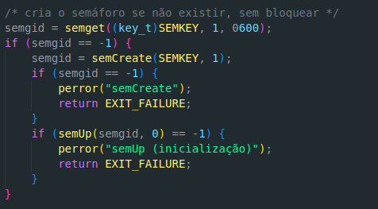
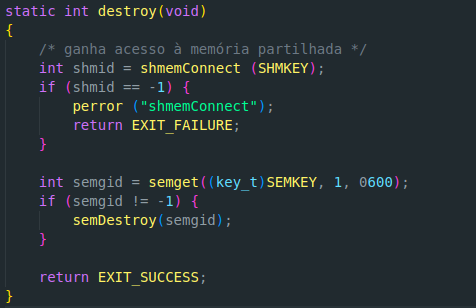
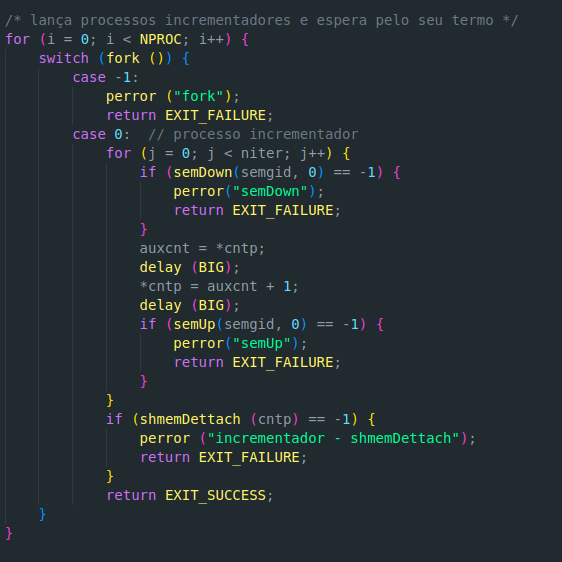
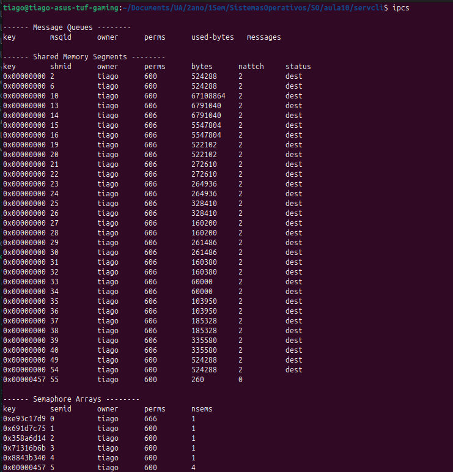

# Exercicio 1

### a)

- O programa começa por defenir uma máscara de código 0660 que representa as permissões do utilizador (rw-), depois vem a função shmemeCreate que é responsável por criar uma região de memória partilhada. ->shmget(key_t key, size_t size, int shmflg) atributos:\
1: chave criada no reg-cri.c (usada para identirficar a memória partilhada);\
2: size, tamanho da memória partilhada a ser alocada;\
3: flags.\
De seguida o shmemConnect, tem como objetico conectar-se a um segmento de memória, -> shmget(key_t key, size_t size, premissões) parâmetros:\
1: key_t é o identificador da memória que queremos acessar\
2: size_t, tamanho do segmento de memória que desejo acessar\
3: permissões ao utilizador.\
De seguida é a função shmemDestroy, que tem objetivo remover ou destruir um segmento de memória. shmctl(int shmid, IPC_RMID, shmid_ds*)\
1: Identificador da memória;\
2: Comando para instruir o sistema a remover a memória partilhada;\
3: Retorno\
A próxima função tem coomo objetivo anexar um segmento de memória partilhada a um processo.\
Vai criar um ponteiro temporario add para armazenar o endereço de memória retornado por shmat(smid, char* NULL, 0), que tem como parametros:\
1: Identificador da memória,\
2: Endereço onde a memória será anexada\
3: Premissões de acesso que serão usadas.\
Se add for diferente de -1, operação bem sucedida, o valor de add é dado ao **pAttAdd.\
E por último temos a função shmemDettatch com objetivo de desanexar a memória partilhada do espaço de endereçamento do processo. Esta função usa o método shmdt que tem como parametro o endereço de memória partilhada que foi anexada.

### b)

- A região crítica do código encontra-se na funçaõ iter(int niter), mais especificamente no proceesso incrementador.

### c)

- Tal como no programa incrementer.c, acontece a mesma anomalia de não serem incrementadas todos os valores devido à condição de corrida que ocorre na região crítica.

### d)

- \
\

# Exercício 2

### a)

- O programa semaphore.c começa por defenir uma máscara que representa oas permissões do utilizador (rw-).\
semCreate(int key, unsigned int snum): cria snum semáforos com id key, usa a systemcall semget() que tem como parâmetros:\
1: key_t o identificador do semáforo;\
2: int A quantidade de semáforos a ser criádos;\
3: Flags adicionais (MASK)\
De seguida o programa faz semConnect com objetivo de conectar ao semáforo, esta função tem apenas como parâmetros o identificador do semáforo. Esta função começa por iniciar uma estrutura, usada para definir operações a serem realizadasnos semáforos. Ela tem como campos :\
sem_num: número de semáforos no conjunto;\
sem_op: A operação a ser realizada (-1 é down e +1 é up);\
sem_flg: Flags adicionais, neste caso 0\
De seguida a função obtém o semgid com o semget anteriormente analisado e chama a função semop que faz um down e um up e retorna o identificador do semáforo.\
De seguida define a dunção semDestroy que tem como argumentos o  semgid e chama a systemcall semctl que destroi o semáforo.\
De seguida define o semSignal que tem como argumentos o id do semáforo que começa por definir uma estrutura sembuf com um up (1) e dá retorno ao id do semáforo com um semop(semgid, &up, 1), anteriormente analizado.\
Por fim define o semDown e o semUp que têm ambas como argumento o id do semáforo e o sindex que é o indice do semáforo especifico dentro do conjunto de semáforos no qual as operações serão organizadas. De seguida define a estrutura sembuf para fazer um down -1 ou 1, depois faz down/up.sem_num = sindex, e por último fazem um retorno do semop a usar o id do semáforo e sembuf.

### b)

- O programa server.c implementa um servidor simples que converte strings recebidas de clientes para maiúsculas. O funcionamento é o seguinte. O funcionamento é o seguinte:\
    O servidor abre um canal de comunicação com servOpenComm();\
    Entra num loop de atendimento:\
        1. Espera por uma mensagem de um cliente com serveReceive(&msg);\
        2. Converte todos os caracteres da string recebida maiúsculas usando toupper;\
        3. Envia a string convertida de volta ao cliente com servSend(&msg);\
        4. Imprime no terminal a confirmação de processamento da String.\
    O canal de Comunicação é fechado com servCloseComm() (embora, neste código, isso só aconteceria se o ciclo terminasse).\
A comunicação entre cliente e servidor é feita por funções abstratas (servOpenComm, servReceive, servSend, servCloseComm) declaradas em comm.h, que provavelmente usam memória partilhada, semáforos ou filas de mensagens para sincronização e troca de dados.

### c)

- O programa client.c implementa o cliente que interage com o servidor de conversão para maiúsculas. O funcionamento é:\
    Abre o canal de comunicação com cliOpenComm();\
    Entra num loop:\
        1. Pede ao utilizador uma mensagem (linha de texto);\
        2. Lê a mensagem do teclado e armazena em msg.data;\
        3. Define o tamanho da mensagem (mas há um erro: deveria ser strlen(msg.data) + 1 para incluir o '\0');\
        4. Envia a mensagem ao servidor com cliSend(&msg);\
        5. Aguarda a resposta do servidor com cliReceive(&msg);\
        6. Imprime a mensagem recebida (que deve estar em maiúsculas).\
    Fecha o canal de comunicação com cliCloseComm() (apenas se o ciclo terminar). A comunicação é feita por funções abstratas (cliOpenComm, cliSend, cliReceive, cliCloseComm) declaradas em comm.h, que provavelmente usam memória partilhada, semáforos ou filas de mensagens.

### d)

- No módulo comm-shm.c, a comunicação entre cliente e servidor é feita por memória partilhada e três semáforos: R, S e A. O papel de cada semáforo é:\
    R (Request): Controla o direito do cliente de fazer um novo pedido. O cliente só pode escrever na memória partilhada quando R está disponível. Depois de ler a resposta, o cliente faz up(R) para permitir um novo pedido;\
    S (Service): Indica ao servidor que há um pedido do cliente para ser processado. O cliente faz up(S) após escrever o pedido; o servidor faz down(S) para esperar por pedidos;\
    A (Answer): Indica ao cliente que a resposta do servidor está pronta. O servidor faz up(A) após escrever a resposta; o cliente faz down(A) para esperar pela resposta.\
    Assim, os semáforos garantem sincronização e exclusão mútua no acesso à memória partilhada, evitando condições de corrida e garantindo a ordem correta das operações.\

### e)

- \
    Shared Memory Segments (Memória Partilhada): Mostra os segmentos criados, com campos como chave (key), id, dono (owner), tamanho, etc;\
    Semaphore Arrays (Semáforos): Mostra os conjuntos de semáforos, com chave, id, dono, número de semáforos, etc;\
    Message Queues (Filas de Mensagens): Mostra as filas de mensagens IPC.\
Cada linha representa um recurso IPC criado por algum processo. Você pode identificar os seus recursos pelo campo owner (normalmente o seu utilizador) e pela key usada no seu código (por exemplo, 1111UL).

### f)

### g)

- A diferença entre ter o server a correr e desligado, é o número de nattch da primeira key, que muda de 0 para 1

### h)

- O número de nattch aumenta conforme quantos clients e servers temos ligados.

### j)

### k)

- O comando ipcrm permite remover recursos IPC (memória partilhada, semáforos, filas de mensagens) manualmente.

### l)

- Para tornar a interação independente da velocidade relativa de execução dos clientes, pode utilizar mecanismos de sincronização como semáforos e buffers (por exemplo, filas ou memória partilhada com múltiplos espaços). Assim, cada cliente pode enviar pedidos ao servidor sem depender do tempo de resposta dos outros, e o servidor pode processar cada pedido à medida que estiver disponível, garantindo que nenhum cliente fica bloqueado à espera da execução dos restantes. Outra solução é implementar o servidor com multithreading, permitindo tratar vários pedidos em paralelo.

