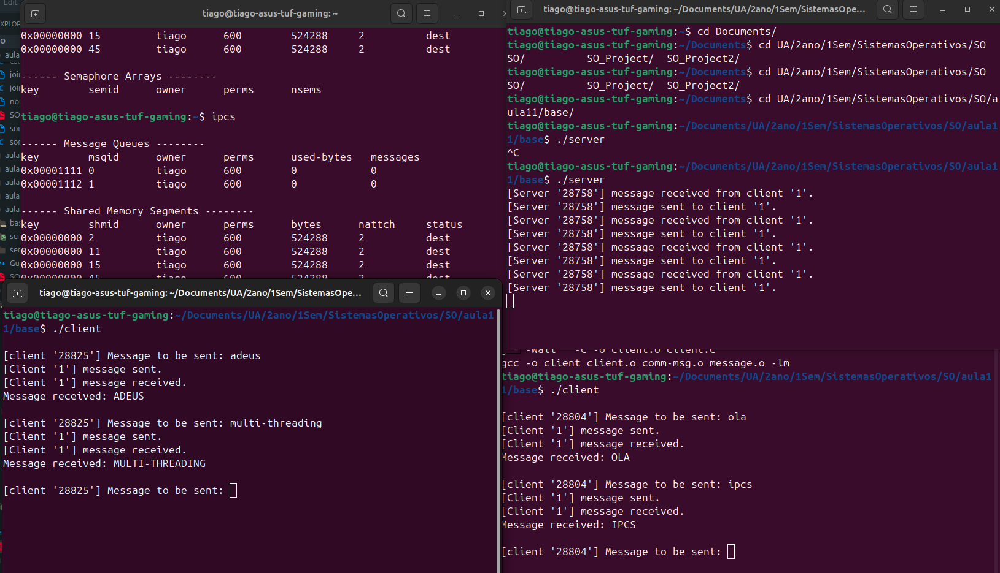
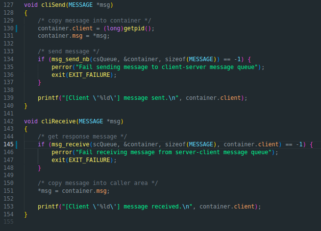

# Guião11

### a)

- O Módulo de Message implementa uma interface simplificada para filas de mensagens System V. Este usa o mecanismo de IPC para fazer comunicação de processos sem relação, as mensagens enviadas pelo client são armazenadas numa fila gerenciada pelo kernel.\
Funcionamento de cada função:
```
msg_create(int key)
/*
1. Faz a system call msgget() com IPC_CREAT | IPC_EXECL
2. Cria uma nova fila de mensagens com a chave fornecida
3. Retorna um identificador único (msgid) para a fila criada
4. Se já existir fila com essa chave dá erro
*/
```

```
msg_connect(int key)
/*
1. Usa a system calll msgget() sem flags de criação
2. Conecta-se a uma fila já existente com a chave única dela
3. Retorna o identificador msgid() da fila já existente
*/
```

```
msg_destroy(int msgid)
/*
1. Usa a system call msgctl com a flag IPC_RMID
2. Remove permanentemente a fila do sistema
3. Libera todos os recursos do kernel
*/
```

```
int msg_send_nb(int msgid, void *msg, int size)
/*
1. Usa a system call msgsnd sem flag IPC_NOWAIT
2. Coloca a mensagem no final da fila
3. Se a fila estiver cheia ocorre block
*/
```

```
// BLOQUEANTE 
int msg_receive(int msgid, void *msg, int size, long dest)
/*
1. Usa msgrcv sem flag IPC_NOWAIT
2. Aguarda até que a mensagem do tipo 'rec' esteja disponivel
*/
```

```
// NÃO BLOQUEANTE
/*
int msg_receive_nb(int msgid, void *msg, int size, long dest, bool *msgrec)
1. Usa system call msgrcv com flag IPC_NOWAIT
2. Tenta receber mensagem do tipo 'rec'
3. Se houver mensagem: Copia para o buffer
4. Se não houver mensagem (fila vazia): Erro, retorna 0
*/
```

### b)

- O server.c tem a funcionalidade principal de receber mensagens alfabéticas do cliente e transformálas em maiúsculas.\
Para isso é usado os métodos do programa comm-msg.c que tem 4 funções principais:\

```
servOpenComm(void)
/*
Método que chama o msg_create do message.c para criar uma fila de mensgens, e tratamento de erro.
*/
```

```
servReceive(MESSAGE *msg)
/*
Método que chama o método do message.c msg_receive que espera receber uma message, depois guarda a message na estrutura container.
*/
```

```
servSend(MESSAGE *msg)
/*
Método que chama o método msg_send_nb() do message.c para retornar ao cliente uma Mensagem.
*/
```

```
servCloseComm(void)
/*
Método que chama a função do message.c msg_destroy para apagar a fila de mensagens guardada.
*/
```

### c)

- O cliente também vai interagir com comm-msg.c para conseguir comunicar com o servidor. Para isso usa 3 funções presentes nesse programa.

```
cliOppenComm(void)
/*
Usa o método de message.c msg_connect(MSG_KEY1) e msg_connect(MSG_KEY2) para se conectar à fila de mensagens.
*/
```

```
cliSend(MESSAGE *msg) 
/*
Usa o método de message.c msg_send_nb para guardar a mensagem na fila de mensagens.
*/
```

```
cliReceive(MESSAGE *msg)
/*
Usa o método de message.c msg_receive() para retornar a mensagem guardada por último na fila de mensagens. No final guarda a mensagem na estrutura container.
*/
```

### d)

- Realizado anteriormente

### e)

- O comando ipcs é usado para listar as filas de mensagens (recursos do UNIX (IPC))

### f e g)

- 

### h)

- - 

### i)

- Terminados com CTRL-C

### j)

- O servidor, ao iniciar, cria duas filas de mensagens IPC: uma para receber pedidos dos clientes e outra para enviar respostas. O cliente liga-se a estas filas já criadas. Quando o cliente quer um serviço, envia uma mensagem (com a string a converter) para a fila de pedidos. O servidor lê essa mensagem, converte a string para maiúsculas e envia a resposta pela fila de respostas. O cliente lê então a resposta e apresenta-a ao utilizador. Todo o processo de comunicação é feito de forma síncrona e controlada pelas funções de abstração implementadas nos módulos de comunicação.

### k)

- O comando ipcrm permite remover recursos IPC (memória partilhada, semáforos, filas de mensagens) manualmente.

### l)

- A diferença do client2 para o client1 é que agora é preciso confirmar autorização para receber a mensagem guardada na fila IPC.

### m)

- Como as mensagens são guardadas numa fila FIFO, logo as mensagens são lidas pela forma de chegada.

### n)

- Uma solução para corrigir este erro, é identificar o client pelo ser pid, no cliSend atualizar a estrutura container para armazenar o pid do calling client e atualizar o cliReceive no método msg_receive para ler o pid guardado.

- - 
