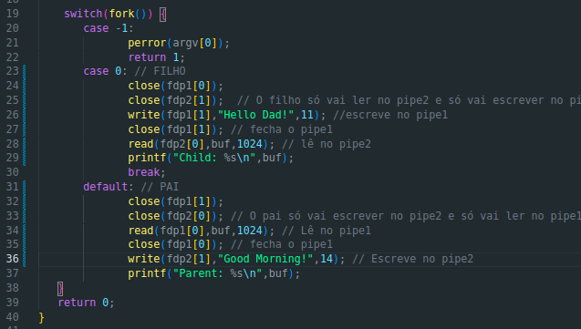
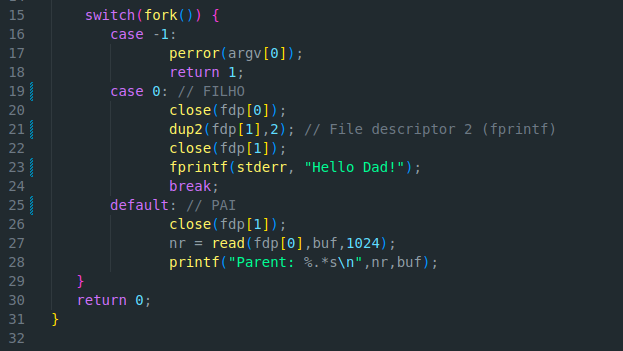
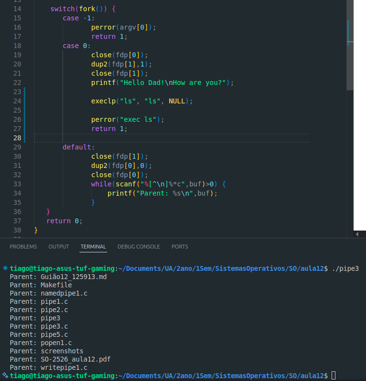

# Exercício 1

### a) 

- pipe() cria um pipe, um canal de data unidirecional que pode ser usado para comunicação interprocessos.
- Analisando o código pipe1.c, ele começa por alocal dinamicamente espaço para 2 inteiros (fdp[2]) usado para o pipe colocar 2 file descriptors (para leitura e escrita) e 1024 caracteres (buf[1024]) usado como buffer onde o processo pai vai guardar os dados lidos do pipe. De seguida é iniciado o pipe (pipe(fdp)), acontece um erro se o resultado for diferente de 0. De seguida acontece o fork, o processo filho é criado com o valor pid = 0. No case do processo filho (case 0) vai fechar a extremidade de leitura (fdp[0]) e vai escrever na extremidade da escrita (fdp[1]) "Hello Dad!" (write(fdp[1],"Hello Dad!",11) Aqui o 11 significa o número de bytes a escrever). No case default (case do parent) comesa por dar close na extremidade de escrita do pipe, depois vai tentar ler até 1024 caracteres do pipe para dentro do buffer e bloqueia até haver dados no pipe. Neste caso assim que o filho fizer write(), os dados ficam no pipe e o pai lê-os.
- No final, é escrito no terminal, pelo processo pai a mensagem "Parent: Hello Dad!" printf("Parent: %s\n",buf), o buf contém a mensagem escrita pelo processo filho ("Hello Dad!").

### b)

- O resultado está de acordo com o descrito.

### c)

- 

### d)

- A system call **dup()** aloca um novo file descriptor que se refere à mesma open file descriptor como um descritor **oldfd**.
- Analisando o código de pipe2.c, cria as extremidades de leitura e de escrita do pipe, o buffer e uma variavel (inteiro) nr.
- Começa por criar um pipe, depois cria um processo filho numa clausula switch. No case 0 (processo filho), é fechada a extremidade de leitura (close(fdp[0])), depois é dado uma cópia de fdp[1] (extremidade de escrita do pipe) para o file descriptor stdout ou seja, o stdout do filho passa a apontar para a extremidade de escrita ou seja, tudo o que o filho imprimir com printf deixa de aparecer no ecrã e passa a aparecer no pipe, de seguida fecha o pipe de escrita e dá printf("Hello Dad!) que vai ser escrito no fdp[1].
- No processo pai, começa por fechar a extremidade de escrita (só vai ler) e depois guarda na variável nr o número de bytes que o read do pipe que o filho mandou via printf. Depois o pai faz print para o terminal "Parent: Hello Dad!" Aqui o %.*s é importante porque garante que o printf imprime exatamente o número de bytes lidos.

### e)

- O resultado está de acordo com o previsto. A resposta a esta pergunta encontra-se na alínea d).

### f)

- 

### g)

- Depois do fork, no case 0 (Processo Filho) é fechada a extremidade de leitura, o filho, so vai escrever no pipe, é copiado a extremidade de escrita para o filedescriptor 1 (printf), de seguida é escrito no pipe "Hello Dad!\nHow are you?" e o processo filho termina.
- O default case (processo pai), vai fechar a extremidade de escrita do pipe (só vai ler) e vai copiar a extremidade de leitura para o file descriptor 0 (stdin), depois abre um loop while que diz, enquanto houver dados no pipe, o pai vai escrever no terminal. Ou seja a saída no terminal será "Parent: Hello Dad!\nParent: How are you?" 

### h)

- 

- Isto acontece porque o output do comando ls vai para stdout (que é cópia da extremidade de escrita do processo filho).

### i)

- O pipe 5 não define o buffer de 1024 caracteres inicialmente. Depois do fork(), o case 0 (processo filho) vai fechar a extremidade de leitura (só vai escrever no pipe) faz uma cópida da extremidade de escrita para stdout, e imprime no stdout o output do comando ls.
- O default case (processo pai), fecha a estremidade de escrita do pipe (só vai ler) faz cópia da extremidade de leitura para o stdin. Depois executa o comando wc -l (comando para contar o número de linhas recebidas por um eventual stdout) como stdin foi redirecionado pelo pipe, ele recebe as linhas listadas pelo ls. Logo o output será o número de linhas do output do comando ls feito pelo processo filho (número de files).